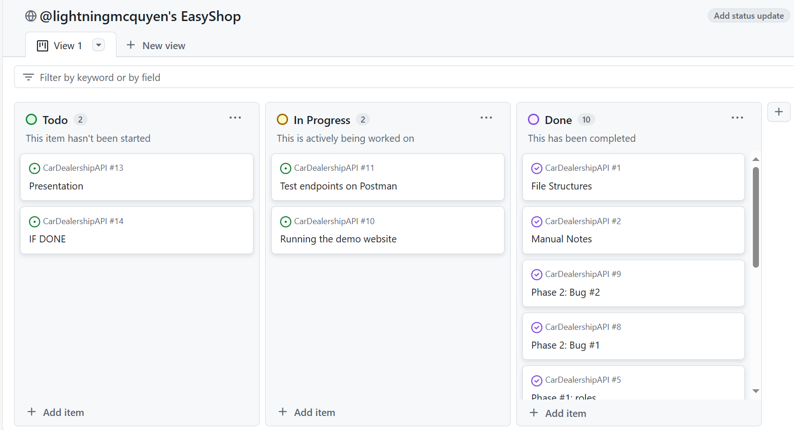
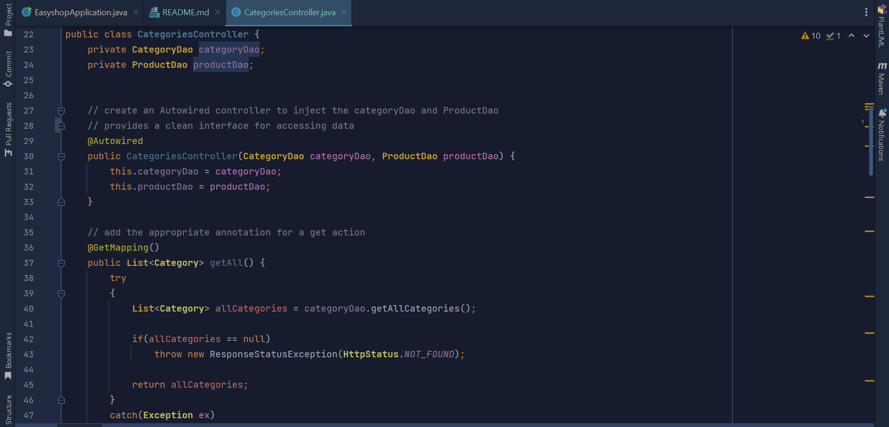
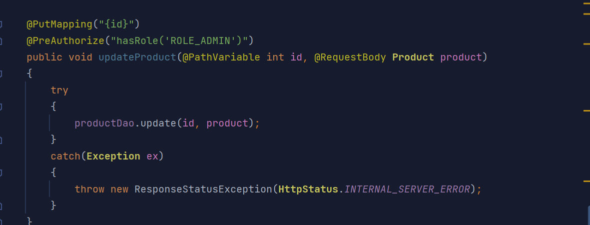
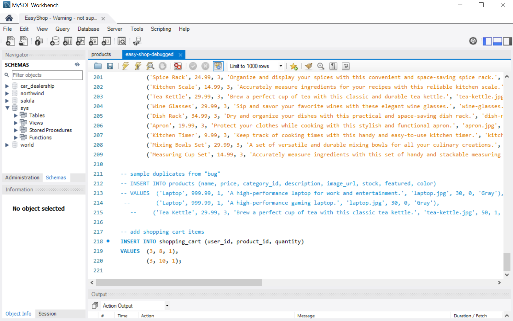

## 

---

---

## Table of Contents
- [Introduction](#introduction)
- [Technologies Used](#technologies-used)
- [Logic Implementation](#logic-implementation)
- [Debugging](#debugging)
- [API Endpoints](#api-endpoints)

---

## Introduction
**EasyShop** version 2 is a simple e-commerce web application developed with Java, Spring Boot, and MySQL. It allows users to browse products, manage their shopping cart, and place orders. Admin users can manage products, categories, and user roles. The system provides secure authentication and authorization for all user actions.

---

## Technologies Used
- **Java 17**
- **Spring Boot 2.7.x**
- **Spring Security** (for authentication and authorization)
- **MySQL** (for the relational database)
- **Hibernate/JPA** (for object-relational mapping)
- **Postman** (for API testing)
- **JWT** (for token-based authentication)

---
# Logic Implementation ##

---
# Debugging

### **BUG 1**

### **BUG 2**

---

## API Endpoints

### **Authentication Endpoints**
- **POST /login**: Logs in a user.
    - **Example:** Login as a new user or admin.

### **Category Endpoints**
- **GET /categories**: Retrieve all categories.
- **POST /categories**: Add a new category.
    - **Note:** Requires admin privileges. Non-admins will receive an error.
- **GET /categories/{id}**: Retrieve a category by ID.
- **DELETE /categories/{id}**: Delete a category by ID.
    - **Example:** Admin users can delete a category, while non-admins cannot.

### **Product Endpoints**
- **GET /products**: Search for products based on filters.
    - **Example:** Check if the number of products matches the filter criteria.

