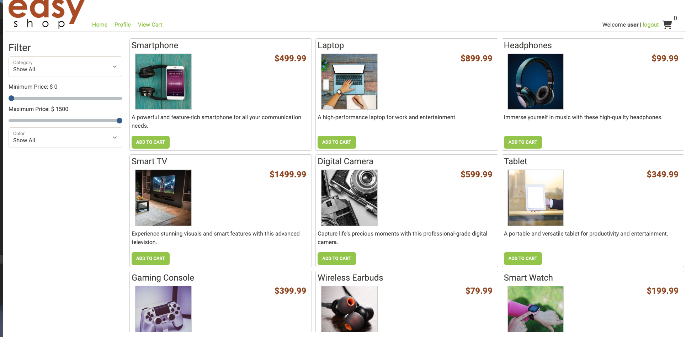

## 

---

---

## Introduction
**EasyShop** version 2 is a simple e-commerce web application developed with Java, Spring Boot, and MySQL. It allows users to browse products, manage their shopping cart, and place orders. Admin users can manage products, categories, and user roles. The system provides secure authentication and authorization for all user actions.

---

## Table of Contents
- [Introduction](#introduction)
- [Technologies Used](#technologies-used)
- [Logic Implementation](#logic-implementation)
- [Debugging](#debugging)
- [API Endpoints](#api-endpoints)
- [Front-end](#front-end)

---

## Technologies Used
- **Java 17**
- **Spring Boot**
- **Spring Security** (for authentication and authorization)
- **MySQL** (for the relational database)
- **Postman** (for API testing)
- **JWT** (for token-based authentication)

---
# Logic Implementation ##

This is just a glance into one of my controller classes for Phase 1. The `CategoriesController` required a lot of implementation. The class had its bones, but I needed to put the organs/logic inside. Like, getting and/or updating the list of categories by ID. I also needed to add the correct annotations to call on the method when it's time to run the tests in Postman...and have it pass.

---
# Debugging

### **BUG 1**

For phase 2, the first bug was in the `MySqlProductDao` class. The SQL query was missing a line and the parameters were inaccurate. The minimum to maximum gage wouldn't have worked otherwise.

---
### **BUG 2**

For the second bug in phase 2, the issue was in the `ProductsController` class. `ProductDao` was calling on the `create` method rather than the `update` method which led to creating duplicates. After I fixed the logic, I proceeded to erase the duplicates in MySQL Workbench.

---

## API Endpoints

### **Authentication Endpoints**
- **POST /login**: Logs in a user.
    - **Example:** Login as a new user or admin.

### **Category Endpoints**
- **GET /categories**: Retrieve all categories.
- **POST /categories**: Add a new category.
    - **Note:** Requires admin privileges. Non-admins will receive an error.
- **GET /categories/{id}**: Retrieve a category by ID.
- **DELETE /categories/{id}**: Delete a category by ID.
    - **Example:** Admin users can delete a category, while non-admins cannot.

### **Product Endpoints**
- **GET /products**: Search for products based on filters.
    - **Example:** Check if the number of products matches the filter criteria.

---
### **Front-end**

